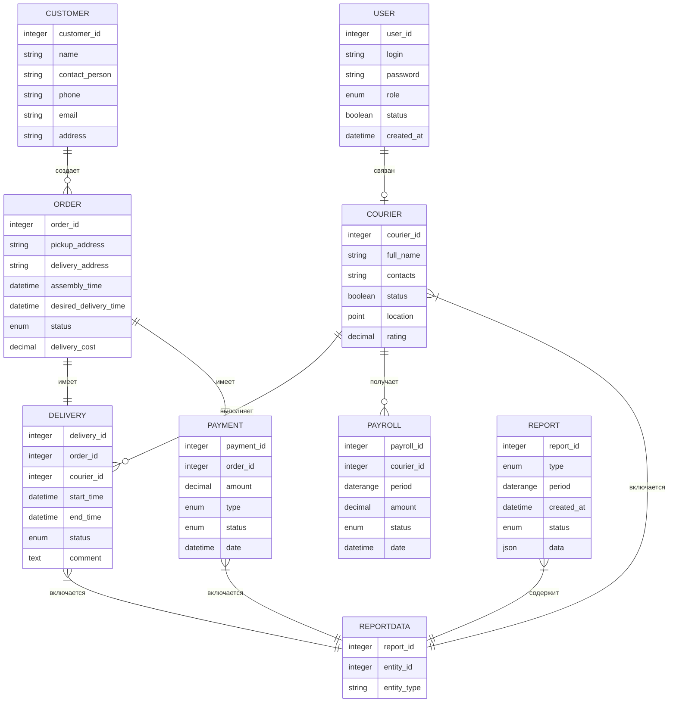

# Логическая модель данных системы доставки заказов

## Описание связей между сущностями

### Основные сущности и их связи:

1. Заказ (Order) <-> Доставка (Delivery)
   - Связь: один-к-одному (1:1)
   - Описание: Один заказ имеет одну доставку

2. Курьер (Courier) <-> Доставка (Delivery)
   - Связь: один-ко-многим (1:M)
   - Описание: Один курьер может выполнять много доставок

3. Клиент (Customer) <-> Заказ (Order)
   - Связь: один-ко-многим (1:M)
   - Описание: Один клиент может иметь много заказов

4. Заказ (Order) <-> Оплата (Payment)
   - Связь: один-к-одному (1:1)
   - Описание: К одному заказу привязана одна оплата

5. Курьер (Courier) <-> Начисление (Payroll)
   - Связь: один-ко-многим (1:M)
   - Описание: Один курьер может иметь много начислений

6. Пользователь (User) <-> Курьер (Courier)
   - Связь: один-к-одному (1:1)
   - Описание: Один пользователь системы может быть связан с одним курьером

### Дополнительные связи:

1. Отчет (Report) <-> Доставка/Оплата/Курьер
   - Связь: многие-ко-многим (M:M)
   - Реализация: Через таблицу ReportData
   - Описание: Один отчет может включать данные о многих сущностях, одна сущность может входить в разные отчеты

## ER-диаграмма

