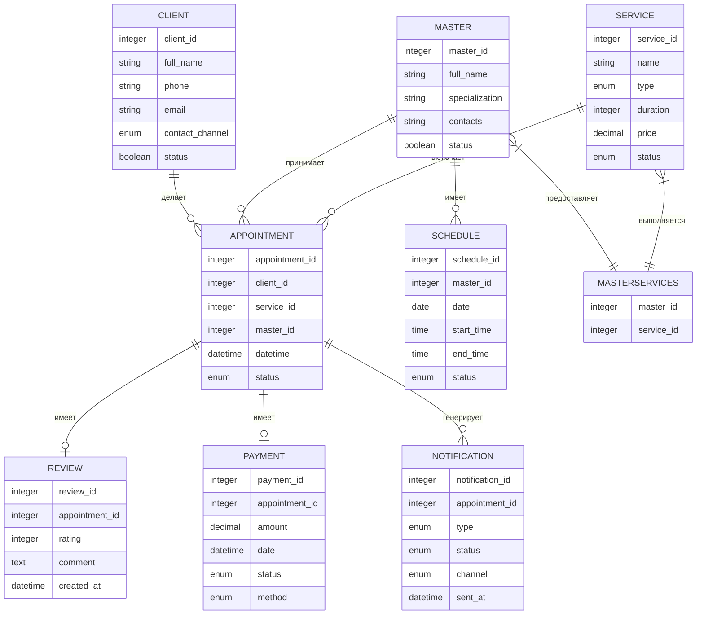

# Логическая модель данных системы онлайн-записи барбершопа

## Описание связей между сущностями

### Основные сущности и их связи:

1. Клиент (Client) <-> Запись (Appointment)
   - Связь: один-ко-многим (1:M)
   - Описание: Один клиент может иметь много записей

2. Мастер (Master) <-> Запись (Appointment)
   - Связь: один-ко-многим (1:M)
   - Описание: Один мастер может иметь много записей

3. Услуга (Service) <-> Запись (Appointment)
   - Связь: один-ко-многим (1:M)
   - Описание: На одну услугу может быть много записей

4. Мастер (Master) <-> Расписание (Schedule)
   - Связь: один-ко-многим (1:M)
   - Описание: У одного мастера может быть много записей в расписании

5. Запись (Appointment) <-> Отзыв (Review)
   - Связь: один-к-одному (1:1)
   - Описание: К одной записи может быть привязан один отзыв

6. Запись (Appointment) <-> Оплата (Payment)
   - Связь: один-к-одному (1:1)
   - Описание: К одной записи привязана одна оплата

7. Запись (Appointment) <-> Уведомление (Notification)
   - Связь: один-ко-многим (1:M)
   - Описание: К одной записи может быть привязано несколько уведомлений

### Дополнительные связи:

1. Мастер (Master) <-> Услуга (Service)
   - Связь: многие-ко-многим (M:M)
   - Реализация: Через таблицу MasterServices
   - Описание: Один мастер может выполнять много услуг, одну услугу могут выполнять много мастеров

## ER-диаграмма

